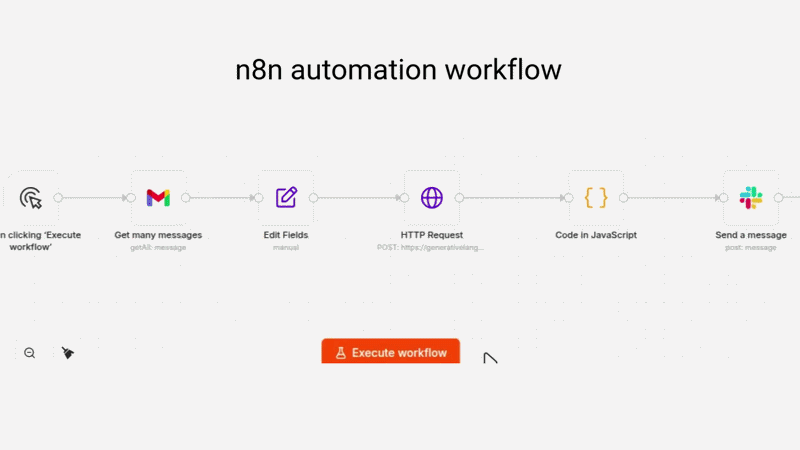
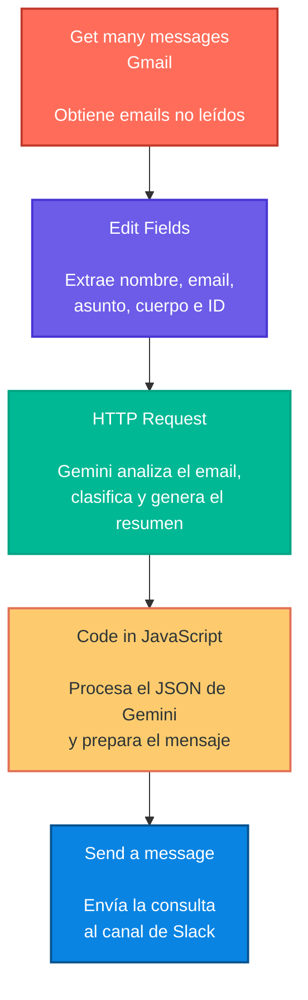

# AI Email Triage Pipeline

Automatización de clasificación y gestión de consultas recibidas por email, desarrollada con **n8n**, **Gemini API**, **Gmail** y **Slack**.

El workflow obtiene emails no leídos y analiza su contenido mediante inteligencia artificial para identificar qué necesita el cliente, qué información es relevante para atender la consulta y qué nivel de prioridad requiere. A partir de este análisis, Gemini clasifica cada email por categoría, asigna una prioridad y genera un resumen compuesto por tres puntos concretos con la información más importante del mensaje.

Finalmente, n8n procesa la respuesta y envía toda esta información de forma estructurada al canal correspondiente de Slack, permitiendo que el equipo pueda entender rápidamente qué solicita el cliente, qué datos debe tener en cuenta y qué atención requiere, sin necesidad de revisar manualmente todo el email original.

---

## Descripción general

En una empresa mayorista de tecnología, los emails recibidos pueden corresponder a diferentes tipos de consultas:

- Soporte técnico
- Compras de productos
- Consultas de reventa
- Consultas generales u otros temas

Revisar y clasificar manualmente cada email puede consumir tiempo y retrasar la atención de las consultas.

Este proyecto automatiza ese proceso inicial:

**Gmail → n8n → Gemini → Clasificación y resumen → Slack**

Para cada email, la automatización determina:

- **Categoría**
- **Prioridad**
- **Resumen**
- **Canal de Slack**

La clasificación se realiza considerando principalmente el contenido completo del email y su contexto, en lugar de depender únicamente de palabras clave aisladas.

---

## Flujo de automatización



El workflow está compuesto por las siguientes etapas:

1. **Obtener emails no leídos desde Gmail**
2. **Extraer los datos relevantes del email**
3. **Enviar el contenido a Gemini**
4. **Clasificar la consulta y determinar su prioridad**
5. **Procesar y estructurar la respuesta mediante JavaScript**
6. **Enviar el resultado al canal correspondiente de Slack**

---

## Arquitectura



### Componentes principales

| Componente | Función |
|---|---|
| **Gmail** | Fuente de los emails recibidos |
| **n8n** | Orquestación y automatización del workflow |
| **Gemini API** | Análisis, clasificación y resumen de los emails |
| **JavaScript** | Procesamiento de la respuesta de la IA y preparación del mensaje |
| **Slack** | Notificación y distribución de las consultas clasificadas |

---

## Lógica de clasificación

Gemini clasifica cada consulta en una de las siguientes cuatro categorías:

| Categoría | Descripción | Canal de Slack |
|---|---|---|
| **Soporte Técnico** | Problemas técnicos, instalación, configuración, compatibilidad, garantía o funcionamiento de productos | `technical-support` |
| **Ventas** | Consultas sobre precios, cotizaciones, disponibilidad, cantidades o intención de compra para uso propio | `sales` |
| **Reventa** | Consultas relacionadas con compras mayoristas, distribuidores, condiciones para revendedores o productos destinados a reventa | `resale` |
| **Otros** | Consultas que no encajan claramente en las categorías anteriores | `other-queries` |

### Prioridad de la información

El **cuerpo del email** tiene prioridad sobre el asunto, ya que este puede ser subjetivo, ambiguo o no reflejar con precisión la intención real del cliente.

El asunto se utiliza únicamente como contexto secundario.

Si existe una **intención explícita de compra o reemplazo**, se prioriza **Ventas frente a las demás categorías**.


---

## Lógica de prioridad

Cada consulta recibe una prioridad:

### Alta

Se asigna cuando la situación requiere atención prioritaria, por ejemplo:

- El cliente indica una necesidad urgente.
- Existe un problema que impide continuar una actividad importante.
- El cliente necesita una solución para poder continuar operando.
- Existe una solicitud comercial que requiere atención prioritaria según el contexto del email.

### Media

Se utiliza cuando la consulta requiere seguimiento o una respuesta para poder avanzar, pero no presenta una urgencia claramente prioritaria.

### Baja

Se utiliza para consultas generales, informativas o exploratorias que no requieren una respuesta inmediata.

La prioridad se determina considerando el contexto completo del mensaje y no únicamente palabras como "urgente", "problema", "precio" o "importante".

---

## Respuesta generada por Gemini

Gemini recibe el contenido del email junto con las reglas de clasificación y debe devolver una respuesta estructurada en formato JSON.

Ejemplo:

```json
{
  "resumen": [
    "El cliente solicita información sobre un producto.",
    "Indica las características y condiciones que necesita.",
    "Solicita una respuesta para poder avanzar con la compra."
  ],
  "categoria": "Ventas",
  "prioridad": "Media",
  "slack_channel": "sales"
}
```
---

## Procesamiento con JavaScript

El nodo **Code in JavaScript** procesa la respuesta de Gemini, extrae la información relevante y construye el mensaje que será enviado a Slack.

Estructura del mensaje:

```text
Nueva consulta recibida

De: [Nombre del cliente]
Email: [Email del cliente]
Asunto: [Asunto del email]

Categoría: [Categoría]
Prioridad: [Prioridad]

Resumen:
• [Punto relevante 1]
• [Punto relevante 2]
• [Punto relevante 3]
```

## Ejemplo de ejecución

A continuación se muestra un ejemplo completo del flujo, desde el email recibido hasta su clasificación y envío a Slack.


Ver todos los casos en [Execution Demos](assets/execution_demo/).
